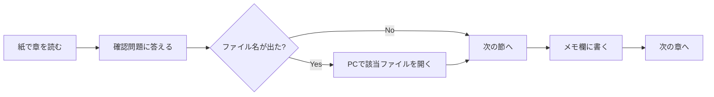

# Classmate開発監督入門

## 副題

**AIに振り回されないための TypeScript・React・WebRTC 基礎**

---

## この教材の目的

あなたは「プロのエンジニアになること」が目的ではありません。

**Cursor / Claude Code などの AI が行った修正を理解し、レビューし、危ない変更に気づけること**が目的です。

Classmate の開発を**監督できるレベル**を目指します。

具体的には、次のことができるようになります。

- AI が出した修正の意図を、おおまかに読み取れる
- 「この変更は接続を壊しそう」と感じたら、理由を言葉にできる
- ログやファイル名を手がかりに、どこを確認すべきか指示できる
- 自分で全部書かなくても、開発の方向性を守れる

---

## 対象者

次のような方を想定しています。

- プログラミング初心者
- TypeScript / React / Next.js はほぼ未経験
- Classmate の仕様や目的は理解している
- WebRTC の細部まで実装したいわけではない
- **「どの状態を信じるべきか」「どの変更が危ないか」**を理解したい

---

## 紙で読むことを前提にした教材です

PC 画面を長時間見ると疲れやすい方のために、この教材は**印刷して読む**ことを想定しています。

| 紙でやること | PCでやること |
|-------------|-------------|
| 概念を理解する | 該当ファイルを開いて確認する |
| 用語を覚える | ログを実際に見る |
| チェックリストを読む | AI に追加質問する |
| メモ欄に書く | build を実行する |

**コードは教材に全部載せません。**

長い実コードは、ファイル名と関数名だけ示します。

必要なときだけ PC で開いてください。

---

## 使い方

### 1. 印刷する

- A4 縦向きを推奨
- 章ごとに分けて印刷すると読みやすい
- 余白にメモを書けるよう、詰め込みすぎない構成にしています

### 2. 1日 15〜30 分で進める

完璧を目指さなくて大丈夫です。

| 週 | 章 | 目安時間 |
|----|-----|---------|
| 1週目 | 第1章 TypeScript | 3〜4日 |
| 2週目 | 第2章 React | 3〜4日 |
| 3週目 | 第3章 Next.js / API | 2〜3日 |
| 4週目 | 第4章 Supabase | 2〜3日 |
| 5週目 | 第5章 通話フロー | 3〜4日 |
| 6週目 | 第6章 ログの読み方 | 2〜3日 |
| 7週目 | 第7章 ステータス表示 | 2〜3日 |
| 8週目 | 第8章 レビュー | 2〜3日 |

1章あたり **5〜10 ページ** を目安にしています。

### 3. PC を開くタイミング

次のときだけ PC を開けば十分です。

- 教材に「このファイルを見る」と書いてあるとき
- 確認問題を解いたあと、答え合わせしたいとき
- AI に修正を頼んだあと、実際の diff を見るとき
- `?debugVoice=1` でログを確認するとき

### 4. 分からないときの AI への聞き方

監督者として、次の聞き方が有効です。

**悪い例（曖昧）**

> 通話が不安定です。直してください。

**良い例（監督者向け）**

> `app/call/CallClient.tsx` の `useEffect` で `presence_sync` のタイミングが変わっています。
> 接続ロジック（`getRemoteIds`）には触れていないか確認してください。
> `debugVoice=1` でどのログを見ればよいか教えてください。

ポイントは次の3つです。

1. **ファイル名**を指定する
2. **何を心配しているか**を書く（接続？表示？DB？）
3. **確認方法**を聞く（ログ、build、再現手順）

---

## この教材で目指すレベル

全部のコードを書ける必要はありません。

次のレベルを目指します。

| レベル | できること |
|--------|-----------|
| 入門 | 変数名や型の意味がわかる |
| 基礎 | useEffect の変更が危ないか感じ取れる |
| 実務監督 | session_members と presence の違いを説明できる |
| レビュー | AI の修正 diff をチェックリストで確認できる |

---

## 各章の概要

### 第1章: TypeScriptを読むための最低限

`01_typescript_basics.md`

- 変数、型、オブジェクト、配列の読み方
- `member.device_id` や `members.filter(...)` の意味
- **目標:** 短い TypeScript 修正を読める

---

### 第2章: Reactの state / effect で何が起きるか

`02_react_state_effect.md`

- `useState`, `useEffect`, `useRef` の役割
- dependency array でバグる理由
- **Classmate例:** `CallClient`, `usePeerConnections`
- **目標:** `useEffect` 変更の危険度を判断できる

---

### 第3章: Next.js と API route の基本

`03_nextjs_api.md`

- `page.tsx` と `route.ts` の違い
- client / server component
- **Classmate例:** `/api/session/status`, `/api/turn`
- **目標:** フロントと API のどちらに問題があるか切り分けられる

---

### 第4章: Supabase と DB テーブルの関係

`04_supabase_tables.md`

- テーブルの基本
- Realtime の雰囲気
- **Classmate例:** `session_members`, `class_presence`
- **目標:** 「信用してよい状態」と「揺れる状態」を区別できる

---

### 第5章: Classmate の入室〜通話開始フロー

`05_classmate_flow.md`

- Home → Room → Call の流れ
- offer / answer / ICE / audio confirmed
- **目標:** 「接続処理中」で止まった段階を推測できる

---

### 第6章: WebRTC ログの読み方

`06_webrtc_voice_logs.md`

- `offer_sent`, `ice_connected`, `audio_confirmed` など
- 分類 A / B / C / D / E
- **目標:** ログから問題の種類を分類できる

---

### 第7章: presence / session_members / UI ステータス

`07_presence_members_status.md`

- 接続対象判定と UI 表示の分離
- `STABLE_VOICE_JOIN_MODE`, `memberStatus.ts`
- **目標:** 今回のような表示ズレの本質を理解する

---

### 第8章: AI 修正レビューのチェックリスト

`08_ai_review_checklist.md`

- diff を見るときの確認項目
- よくある事故例（fast path, presence_sync, memberStatus）
- **目標:** AI 修正後に最低限レビューできる

---

## 学習の進め方（おすすめ）

1. 紙で読む（15〜30分）
2. 確認問題を考える（メモ欄に書く）
3. 必要なら PC でファイルを開く（5〜10分）
4. 翌日、別の章に進む

**一度に全部理解しようとしないでください。**

監督者は「全部書ける人」ではなく「危ない変更に気づける人」です。

---

## 教材ファイル一覧

| ファイル | 内容 |
|---------|------|
| `00_curriculum.md` | このファイル（全体案内） |
| `01_typescript_basics.md` | 第1章 |
| `02_react_state_effect.md` | 第2章 |
| `03_nextjs_api.md` | 第3章 |
| `04_supabase_tables.md` | 第4章 |
| `05_classmate_flow.md` | 第5章 |
| `06_webrtc_voice_logs.md` | 第6章 |
| `07_presence_members_status.md` | 第7章 |
| `08_ai_review_checklist.md` | 第8章 |

---

## 自分のメモ

学習開始日: _______________

いま一番不安なこと: _______________________________________________

___________________________________________________________________

___________________________________________________________________

この教材で必ず理解したいこと: _____________________________________

___________________________________________________________________

___________________________________________________________________
