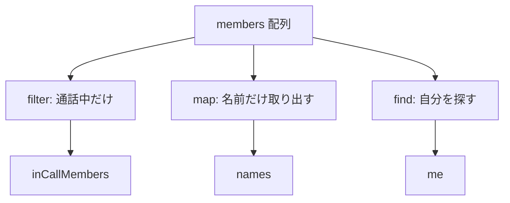

# 第1章: TypeScriptを読むための最低限

**Classmate開発監督入門** — 第1章

---

## この章で分かること

- TypeScript が何のためにあるか
- `const` / `let`、型、`object` / `array` の読み方
- `null` / `undefined` と `??` の意味
- `if` / `return` の流れ
- `filter` / `map` / `find` で配列を扱う読み方
- `async` / `await` の雰囲気

**目標:** Cursor が出した**短い TypeScript 修正**を、おおまかに読めるようになる。

---

## 1. TypeScript とは何か

TypeScript（タイプスクリプト）は、JavaScript に**型（タイプ）**を足した言語です。

### 型とは

「この箱には、どんなデータが入るか」を示すラベルだと思ってください。

| 型 | 意味 | Classmate の例 |
|----|------|----------------|
| `string` | 文字列 | `"田中"`, `sessionId` |
| `number` | 数値 | `3`, `30000` |
| `boolean` | 真偽値 | `true`, `false` |
| `object` | まとまったデータ | `member` オブジェクト |
| `array` | 配列（リスト） | `members` の一覧 |

### なぜ Classmate で TypeScript を読む必要があるか

Classmate のコードはほぼすべて TypeScript です。

AI が修正を出すとき、次のようなコードがよく出てきます。

```ts
const deviceId = String(member.device_id ?? "").trim();
```

監督者として知っておきたいのは次のことです。

- **何のデータを扱っているか**（device_id なのか sessionId なのか）
- **欠けている値をどう扱っているか**（`??` や `?`）
- **条件分岐で何を守っているか**（`if` の中身）

全部書ける必要はありません。**読んで意味を追えれば十分**です。

---

## 2. const と let — 変数の宣言

### const（コンスト）

一度入れたら、**基本的に入れ替えない**箱です。

```ts
const sessionId = "abc-123";
const deviceId = getDeviceId();
```

Classmate では、セッション ID や端末 ID は `const` で宣言されることが多いです。

### let（レット）

**あとから値を変えてよい**箱です。

```ts
let inCall = 0;
inCall = inCall + 1;
```

### 監督者のポイント

- AI が `const` を `let` に変えた → **値が後から変わる設計になった**サイン
- 逆に `let` を `const` に変えた → 意図的に変更を防いでいる可能性

---

## 3. string / number / boolean

### string（文字列）

```ts
const name = "太郎";
const sessionId = String(c.session_id ?? "").trim();
```

`String(...)` は、何かを文字列に変換します。

`.trim()` は、前後の空白を取り除きます。

### number（数値）

```ts
const graceMs = 30_000;
const count = members.length;
```

`30_000` の `_` は読みやすさのためで、30000 と同じです。

### boolean（真偽値）

```ts
const isInCall = member.is_in_call === true;
const stable = STABLE_VOICE_JOIN_MODE;
```

`=== true` は、「本当に true か」を厳密に調べます。

`undefined` や `null` を誤って true とみなさないためです。

---

## 4. object（オブジェクト）— まとまったデータ

Classmate では、メンバー情報はオブジェクトで表されます。

```ts
type Member = {
  device_id: string;
  display_name: string;
  is_in_call?: boolean;
  screen?: string;
};
```

### プロパティへのアクセス

```ts
member.device_id
member.display_name
member.is_in_call
```

ドット（`.`）で中身を取り出します。

### Classmate でよく見るオブジェクト

| 変数名 | 中身の例 |
|--------|---------|
| `member` | 1人分の参加者情報 |
| `members` | 参加者の配列 |
| `presenceMap` | device_id をキーにした presence 情報 |

---

## 5. array（配列）— リスト

```ts
const members: Member[] = [];
```

`Member[]` は「Member の配列」という意味です。

### よく使う配列の性質

```ts
members.length   // 人数
members[0]       // 先頭の要素
```

---

## 6. type と interface — 設計図

`type` や `interface` は、**オブジェクトの形を定義する設計図**です。

```ts
type UiParticipationStatus = "in_call" | "waiting" | "offline";
```

これは「この値は3つの文字列のどれか」と決めています。

### 監督者のポイント

AI が型を変更したときは要注意です。

- 新しい状態（例: `"connecting"`）が増えた
- `boolean` が `boolean | null` になった

→ **UI や接続ロジックの両方に影響**することがあります。

---

## 7. optional property（省略可能なプロパティ）

`?` が付いたプロパティは、**無いかもしれない**という意味です。

```ts
type Member = {
  device_id: string;
  is_in_call?: boolean;   // 無い場合がある
  screen?: string;        // 無い場合がある
};
```

### なぜ重要か

Classmate では `is_in_call` や `screen` は**常に正確とは限りません**。

後の章で学びますが、presence は揺れる情報です。

だから optional として扱われています。

---

## 8. null と undefined — 「無い」と「未設定」

| 値 | ざっくりした意味 |
|----|----------------|
| `undefined` | まだ設定されていない |
| `null` | 意図的に「無い」とされた |

### ??（ヌル合体演算子）

左が `null` か `undefined` なら、右を使う。

```ts
const deviceId = String(member.device_id ?? "").trim();
```

`device_id` が無ければ `""`（空文字）を使う、という意味です。

### ?.（オプショナルチェーン）

途中が無ければ、エラーにせず `undefined` を返す。

```ts
presenceMap[memberId]?.screen
```

### 監督者のポイント

AI が `??` や `?.` を削除した変更は要注意です。

**値が無いときにクラッシュしたり、誤判定したり**しやすくなります。

---

## 9. if と return — 条件と早期終了

### if（もし〜なら）

```ts
if (!deviceId) return;
if (member.is_in_call === true) {
  inCall += 1;
}
```

### return（ここで結果を返して終わる）

関数の中で `return` があると、**そこで処理が終わります**。

```ts
function resolveLabel(member: Member): string {
  if (!member.device_id) {
    return "不明";
  }
  return member.display_name;
}
```

### Classmate 風の例

```ts
if (localExitedCall) {
  return { status: "waiting", label: "待機中" };
}
```

「明示的に退室した人は待機中」と決めて、すぐ返しています。

---

## 10. filter / map / find — 配列の操作

監督者がよく見る3つだけ押さえます。

### filter — 条件に合うものだけ残す

```ts
const inCallMembers = members.filter(
  (m) => m.is_in_call === true
);
```

### map — それぞれを変換する

```ts
const names = members.map((m) => m.display_name);
```

### find — 条件に合う最初の1件

```ts
const me = members.find(
  (m) => m.device_id === deviceId
);
```

### 図解



### 監督者のポイント

AI が `filter` の条件を変えたときは、次を確認してください。

- **誰がリストから消えるか**が変わっていないか
- 接続対象（remote）の選び方に影響していないか

該当ファイルの例: `app/call/voice/usePeerConnections.ts` の `getRemoteIds`

---

## 11. async / await の雰囲気

### async（非同期）

ネットワーク待ちなど、**時間がかかる処理**によく付きます。

```ts
async function fetchMembers() {
  const res = await fetch("/api/session/status");
  const data = await res.json();
  return data.members;
}
```

### await（待つ）

`await` は「終わるまで待つ」という意味です。

### 監督者のポイント

次の変更は要注意です。

- `await` を削除した
- エラー処理（`try/catch`）を削除した
- fetch の URL やタイミングを変えた

該当ファイルの例:

- `app/call/CallClient.tsx` の `fetchStatus`
- `app/room/RoomClient.tsx` の `fetchStatus`

---

## 12. この章で読めるようになるコード

次のような短いコードなら、意味を追えるようになっています。

```ts
const deviceId = String(member.device_id ?? "").trim();
if (!deviceId) return;

const isInCall = member.is_in_call === true;
const visibleMembers = members.filter((m) => !!m.device_id);

const me = members.find((m) => m.device_id === deviceId);
const names = visibleMembers.map((m) => m.display_name);
```

### 読み方の手順（紙に書いておくと便利）

1. **変数名**を見る（何の ID か）
2. **型や `?`** を見る（無いかもしれないか）
3. **`if` / `return`** を見る（早期に何を弾いているか）
4. **`filter` / `map`** を見る（誰が対象から外れるか）

---

## 13. Classmate のファイルと用語対応表

| 教材の用語 | Classmate での場所 |
|-----------|-------------------|
| `member.device_id` | `app/call/CallClient.tsx`, `app/room/RoomClient.tsx` |
| `member.is_in_call` | `lib/memberStatus.ts`, presence 関連 |
| `members.filter` | `usePeerConnections.ts`, `RoomClient.tsx` |
| `sessionId` | 通話セッションの ID |
| `deviceId` | 端末ごとのユーザー ID |

---

## 確認問題（3問）

紙のメモ欄に答えを書いてみてください。正解は次ページにあります。

---

**問1**

次のコードは何をしていますか？

```ts
const deviceId = String(member.device_id ?? "").trim();
if (!deviceId) return;
```

---

**問2**

`member.is_in_call?: boolean` の `?` は何を意味しますか？
Classmate ではなぜ optional として扱うことが多いですか？

---

**問3**

```ts
const remotes = members.filter((m) => m.device_id !== myDeviceId);
```

この1行で、どんなメンバーが `remotes` に入りますか？
AI がこの条件を変えたとき、何を確認すべきですか？

---

## 確認問題の答え

**問1の答え**

1. `member.device_id` を文字列にし、無ければ空文字にする
2. 前後の空白を取る
3. 空なら、ここで処理を終える（以降を実行しない）

---

**問2の答え**

`?` は「このプロパティは無い場合がある」という意味です。

Classmate では `is_in_call` は presence 同期のタイミングで一時的に欠落・揺れすることがあるため、optional として扱われます。

---

**問3の答え**

自分（`myDeviceId`）以外のメンバーが入ります。

AI が条件を変えたら、「誰が接続対象から外れるか」「通話相手のリストが空にならないか」を確認します。

---

## AI修正レビューで見るポイント（第1章）

短い TypeScript 修正を見るときは、次を確認してください。

- [ ] `??` や `?.` が消されていないか
- [ ] `=== true` が `== true` や単なる `if (flag)` に緩められていないか
- [ ] `filter` の条件変更で、対象者が意図せず消えないか
- [ ] 型定義に新しい状態が増えたとき、UI と接続の両方への影響
- [ ] `async/await` やエラー処理が削除されていないか

---

## 自分のメモ

日付: _______________

この章で一番大事だと思ったこと:

___________________________________________________________________

___________________________________________________________________

まだ分からないこと:

___________________________________________________________________

___________________________________________________________________

次に PC で開きたいファイル:

___________________________________________________________________

___________________________________________________________________

---

*次章: `02_react_state_effect.md` — React の state / effect で何が起きるか*
